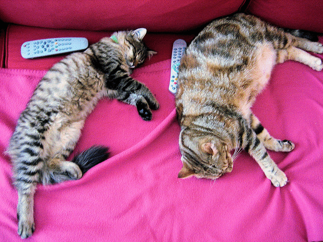
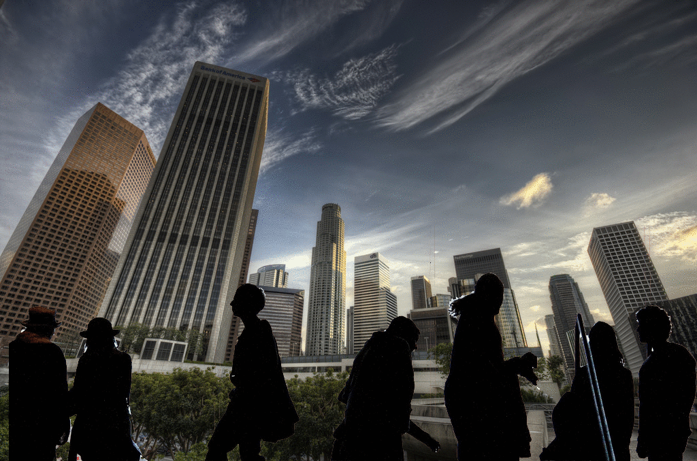
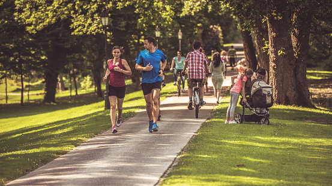

# Auto-Lama
Auto-Lama combines object detection and image inpainting to automate object removals. It is build on top of [DE:TR](https://github.com/facebookresearch/detr) from Facebook Research and [Lama](https://github.com/saic-mdal/lama) from Samsung Research. The entire process is extremely simple:

1. Objects are detected using the detector.
1. Masks are generated based on the bounding boxes drawn by the detector.
1. The original image is sent to the inpainter along with the masks.

## Demo




## Masking

There are currently a few ways of generating masks:
1. Masking objects with specified indices.
1. Masking one main object at a time.
1. Masking all other objects other than the main object.

## Future Goals
1. Use a more precise segmentation method other than bounding boxes
1. Implementing a detector that has more

# Environment Setup

## Prerequisites
1. `docker`
1. `make`
1. `conda`

## Building Environment
1.`make build-conda-env`
1.`conda activate auto-lama`
1.`make build-env`

## Cleaning Directory
1. `make clean`


# Detect and Inpaint
## Setup
The default config for the detector is 
``` python
PARAMETERS = {
    "model_name": "facebook/detr-resnet-50",
    "threshold": 0.9,
    "max_items": 10,
    "save_destination": "./test_images",
    "output_destination": "./output_images",
    "max_width": 2000,
    "max_height": 2000,
    "resize": True,
    "resize_scale": 0.75,
    "excluded_objects": [91],
    "image_format": "PNG",
    "mask_target_items": [],
}
```

Please reference [here](https://tech.amikelive.com/node-718/what-object-categories-labels-are-in-coco-dataset/) for the target items that you want to mask, as the default DE:TR uses the COCO Dataset, 

## Run
1. `make detect_and_inpaint IMAGE_PATH=path/to/image` or `make detect_and_inpaint IMAGE_PATH={image_url}`


